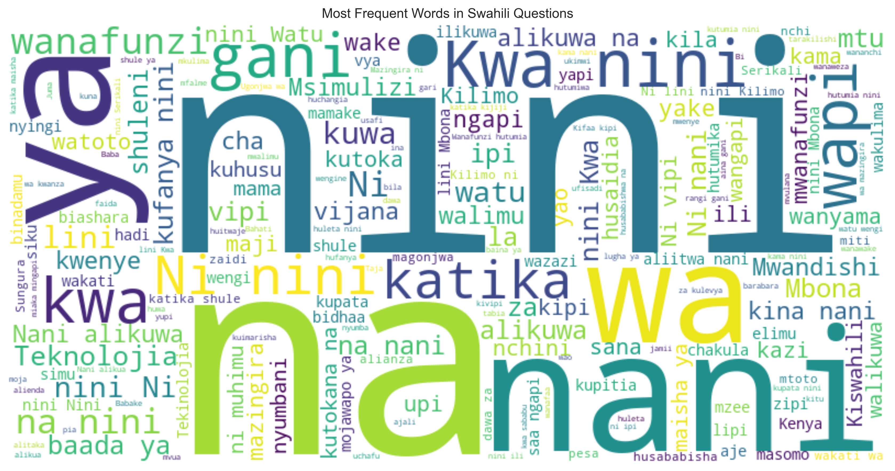
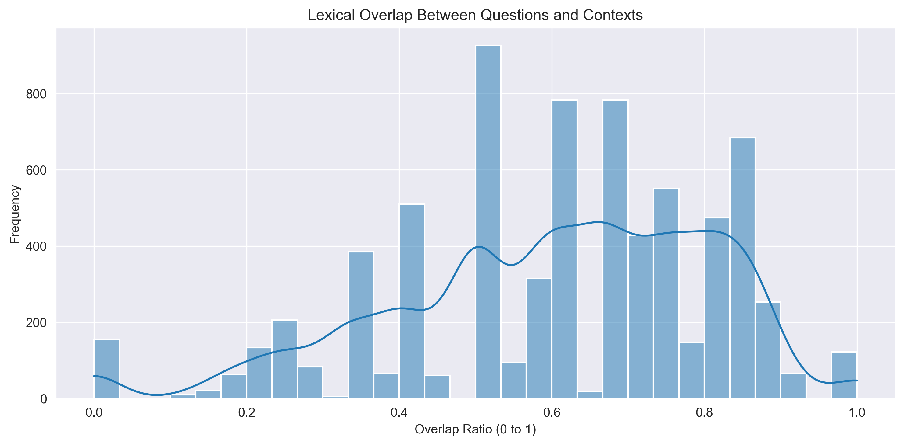
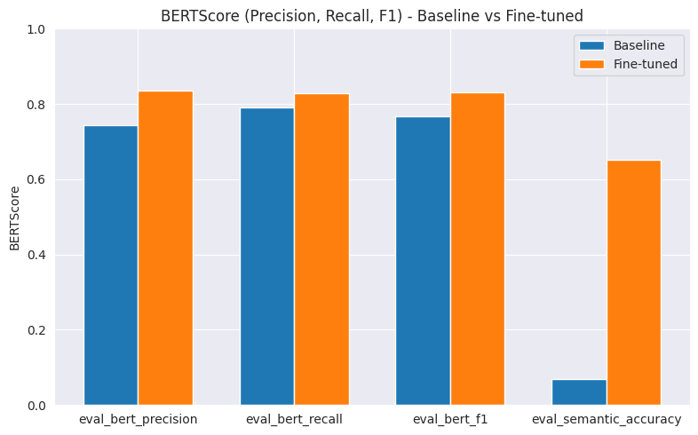
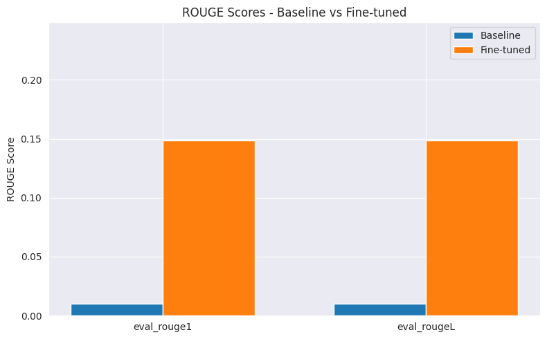

# 🧠 **Swahili Question Answering (QA) System**

## 📌 **Overview**

This project fine-tunes the multilingual transformer model mT5-small for the task of sequence to sequence question answering in Swahili. The goal is to build a robust QA system that can accurately provide answers to natural-language questions using Swahili context passages. This initiative supports the advancement of NLP tools in underrepresented African languages, helping make intelligent systems more inclusive.

## 🔍 **1.0 Business Understanding**

In an age of rapid digital transformation, equitable access to AI-driven tools is critical for inclusive knowledge sharing. Despite being spoken by over 100 million people across East and Central Africa, Swahili remains vastly underrepresented in the field of Natural Language Processing (NLP). This imbalance limits the development of intelligent systems capable of processing Swahili text, particularly in the domain of question answering (QA). The absence of such systems creates barriers in accessing information related to education, public services, and healthcare for Swahili-speaking communities.

This project aims to bridge this gap by building a Swahili QA system that leverages machine learning to provide accurate, real-time answers to fact-based questions. By doing so, we contribute to the digital inclusion of one of Africa’s most widely spoken languages and support broader access to knowledge for Swahili users.

### ⚠️ **1.1 Challenges**

Key challenges include:

1. Limited availability of large-scale annotated Swahili QA datasets
2. Scarcity of pre-trained NLP models optimized for Swahili language tasks
3. High computational costs associated with training deep learning models
4. Linguistic variability and dialectal differences within Swahili
5. Difficulty in achieving high accuracy across diverse domains (e.g., education, health)

### 💡 **1.2 Proposed Solution**

To address these challenges, we propose:

1. Fine-tuning multilingual transformer models such as mBERT and AfriBERTa using Swahili QA data
2. Expanding training data through data augmentation techniques like back-translation
4. Extracting linguistic features such as token similarity and question-context overlap
5. Evaluating performance across multiple question types and linguistic structures
6. Deploying a user-friendly, web-based interface for real-time Swahili QA

### ✅ **1.3 Conclusion**

By building a robust, intelligent QA system for Swahili, this project empowers millions of speakers with instant access to accurate, AI-driven responses. The system supports digital inclusion and strengthens infrastructure for AI development in low-resource languages. Its applications span education, public communication, and local governance areas where timely, accurate information is essential.

### 📌 **1.4 Problem Statement**

There is currently a lack of intelligent, real-time question-answering systems tailored for the Swahili language. This gap limits efficient access to structured information for millions across East Africa. Shujaa Data Analytics has been engaged to develop a machine learning-based QA model that interprets Swahili questions and returns accurate answers based on a given context. Traditional methods of information access are slow, manual, and language-restrictive, creating the need for an automated, Swahili-native solution.

### 🎯 **1.5 Objectives**

1. To explore and analyze linguistic patterns in Swahili QA data
2. To investigate relationships between questions, contexts, and answers
3. To fine-tune a multilingual sequence-to-sequence model to generate accurate, context-aware answers to Swahili questions based on combined question-context inputs.
4. To deploy the trained QA model in a user-friendly web application using Streamlit and FastAPI

## 📊 **2.0 Data Understanding**

Understanding the structure and characteristics of the dataset is crucial for developing a robust Swahili Question Answering (QA) system. This phase focuses on exploring the dataset's key features, evaluating the quality of the data, and identifying patterns that inform preprocessing, modeling, and deployment. The insights gained during this stage guide effective feature engineering and model selection.

### 🌐 **2.1 Data Source**

The primary dataset used for this project is KenSwQuAD, a curated Swahili question answering dataset designed to support machine learning tasks in low-resource language settings. The dataset contains a total of 7,347 entries, each comprising a Swahili context passage, a related question, and its corresponding answer span extracted from the context. It follows a similar structure to the widely used SQuAD format, making it suitable for training transformer-based models.

📎 Access: KenSwQuAD https://huggingface.co/datasets/lightblue/KenSwQuAD

### 🧾 **2.2 Column Description**

The dataset consists of the following key columns:

- `Story_ID`: A unique identifier for each context-question-answer group
- `context`: A paragraph of Swahili text providing the background for the QA task
- `question`: A fact-based question in Swahili related to the provided context
- `answer`: The correct answer extracted directly from the context passage

### 📊 **2.3 Key Findings**

- Distribution of Swahili linguitic patterns

- Relationship between questions and context

Data preprocessing ensures:

- Cleaning and Chunking of the text.
- Tokenization using mT5-compatible tokenizer with truncation and padding.
- Dataset splits into training, testing and validation subsets through group splitting.

## 🧪 **3.0 Modeling**

###  ⚙️ **3.1 Approach**

- Model: `mT5-small`
- Tokenization: Truncation and padding handled by `AutoTokenizer`
- Task: Sequence-to-sequence training (input = context + question, output = answer)
- Trainer: Hugging Face `Seq2SeqTrainer`

### 🔧 **3.2 Training Configuration**

| Parameter      | Value       |
|----------------|-------------|
| Epochs         | 4           |
| Learning Rate  | 2e-4        |
| Batch Size     | 4           |
| Early Stopping | Enabled     |
| Weight Decay   | 0.01        |

The model is trained on Swahili QA pairs using both context and question as input and predicting the answer text.

## 📈 **4.0 Evaluation**

The fine-tuned model is evaluated using both automatic and semantic metrics:

| Metric              | Explanation|
|---------------------|------------|
| ROUGE-1 / ROUGE-L   | Measures n-gram overlap between predicted and reference answers. |
| BERTScore (P/R/F1)  | Measures semantic similarity using contextual embeddings, ideal for QA tasks.|

### 🔍 **4.1 Results**

| Metric          | Baseline (mT5) | Fine-tuned mT5 |
|-----------------|----------------|----------------|
| ROUGE-1         |	0.0103         | 0.1487         |
| ROUGE-L         |	0.0102         | 0.1486         |
| BERT Precision  | 0.7439         | 0.8347         |
| BERT Recall     | 0.7912         | 0.8282         |
| BERT F1         |	0.7664         | 0.8310         |
| Validation Loss |	22.6045        | 3.3745         |

### 🧵 **4.2 Metric Comparison Chart**

These improvements demonstrate the effectiveness of fine-tuning mT5 for Swahili question answering tasks.

## ✅ **5.0 Conclusion**

This project successfully demonstrates that multilingual models like mT5-small can be fine-tuned to perform competitively on sequence to sequence question answering tasks in Swahili—a low-resource language.

### ✔️ Key Takeaways:

- mT5 shows significant performance gains after fine-tuning.
- The model generalizes reasonably well, especially on unseen Swahili QA examples.
- Evaluation metrics indicate both lexical and semantic improvements over the baseline.

### 🔮 Future Work:

- Experiment with larger variants like mT5-base.
- Improve the data quality to include more long structered answers.
- Incorporate extractive QA transformers. 
